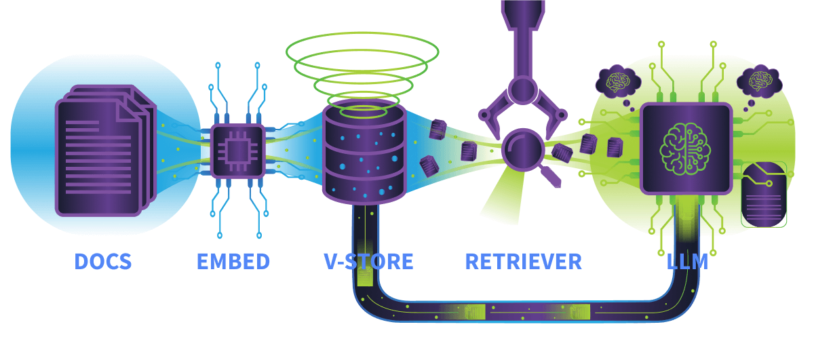
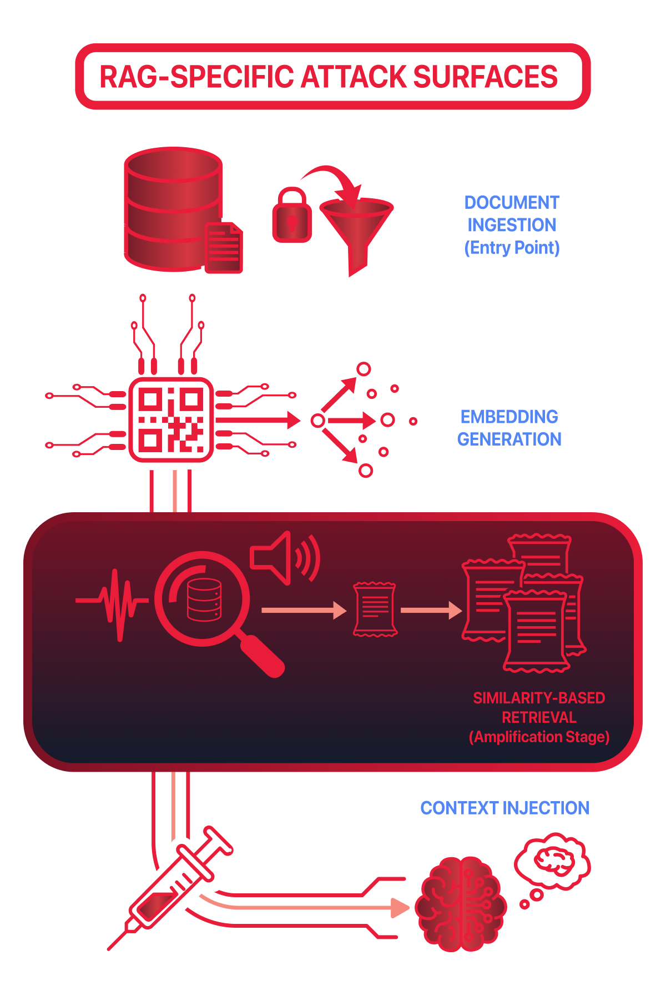
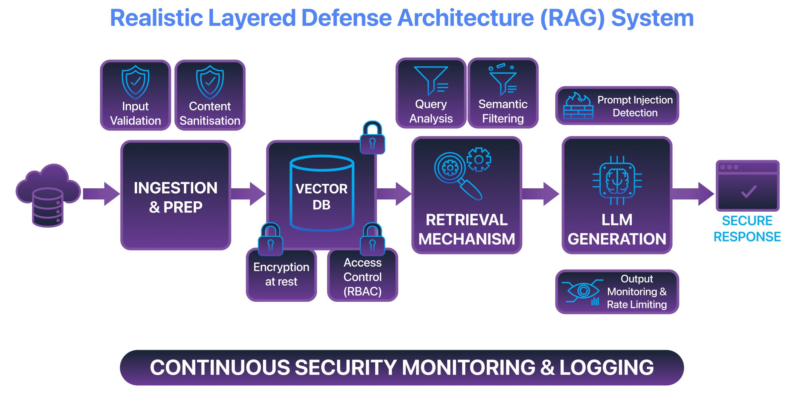

 # RAG (Retrieval-Augmented Generation) — Security Notes

RAG improves LLMs by fetching relevant external documents at inference time and using them as additional context. This boosts accuracy and freshness but increases the attack surface because retrieved documents may be malicious or incorrect.

## Key Points

- **Traditional LLMs:** answer using only training data.
- **RAG systems:** retrieve external information before generating a response.
- **Benefits:** better accuracy, fresher knowledge, domain-specific answers.
- **Risks:** malicious or poisoned documents can influence outputs.
- **Attack vectors:** context injection, retrieval manipulation, and trust-boundary abuse.
- **Security focus:** protect retrieval sources, validate retrieved content, and manage trust in external data.

**Takeaway:** RAG boosts an LLM's knowledge with live data, but every retrieved document is a potential attack surface.

---

## Task 2 — Overview

### Main idea

RAG gives an LLM external documents at runtime; the model does not inherently verify whether that information is safe or correct. If bad data is retrieved, the model can be influenced.

### Key risks

- **Inference-time poisoning:** malicious documents affect responses without retraining.
- **Context injection:** retrieved content changes model behavior.
- **Instruction injection:** retrieved text contains hidden instructions that override intended behavior.

### Core components

- **Embedding model:** converts text into vectors (embeddings).
- **Vector store:** stores document embeddings.
- **Retriever:** finds relevant documents.
- **LLM:** generates the final answer.

### Data flow

1. User query
2. Query → embedding
3. Vector search
4. Retrieve top documents
5. Inject documents into context
6. LLM generates response

### High-risk areas

- **Ingestion:** malicious documents enter the system.
- **Retrieval:** poisoned documents rank highly.
- **Context injection:** retrieved content manipulates output.

### Quick Q&A

- Q: What numerical representation is used to capture the meaning of text in RAG systems?
  - A: Embeddings
- Q: Which component selects the documents for the LLM?
  - A: Retriever

---

## Task 3 — RAG Attack Surfaces

### Document ingestion

Documents enter the knowledge base. Risk: malicious or untrusted documents can be added.

### Embedding generation

Converts text into embeddings (vectors). Risk: source, author, and trust metadata are lost. Key idea: embeddings capture meaning, not trust.

### Similarity-based retrieval

Finds documents based on semantic relevance. Risk: relevant documents may still be malicious. Key idea: relevant ≠ trusted.

### Context injection

Retrieved documents are inserted into the LLM's context. Risk: hidden instructions can influence model behavior. Key idea: the LLM treats retrieved content as trusted context.

### Why retrieval is the highest risk

- Controls what information reaches the model.
- The model cannot verify source, intent, or trustworthiness.
- Malicious content only needs to be retrieved to affect outputs.

### Q&A

- Q: Which RAG stage introduces the largest indirect attack surface?
  - A: Retrieval
- Q: What is lost during embedding generation that affects security?
  - A: Context

---

## Task 4 — Retrieval Abuse

### Types of abuse

- **Passive poisoning:** malicious content is added once; attacker waits for normal queries to retrieve it.
- **Active manipulation:** content is crafted to rank highly for common or sensitive queries.
- **Context manipulation:** retrieved documents injected into context contain false information or hidden instructions.

### Model limitations

- Cannot verify document intent.
- Cannot see retrieval rankings.
- Cannot distinguish instructions from data — treats retrieved content as trusted context.

### Why it matters

- Attackers can influence outputs without touching prompts.
- Retrieval can indirectly override system intent.
- Misinformation can appear legitimate and well-structured.
- Detection is hard because retrieval may appear to be working normally.

### Q&A

- Q: What retrieval-abuse technique involves crafting malicious content so it ranks highly for sensitive queries?
  - A: Active manipulation
- Q: What does retrieval select documents based on?
  - A: Semantic relevance

**One-line summary:** Retrieval abuse manipulates what documents get retrieved, allowing attackers to influence model outputs through seemingly legitimate context.

---

## Task 5 — Failure Case Studies

### Microsoft Copilot (2026)

- Emails were used as retrieval sources.
- Retrieved email content influenced responses.
- The model could not distinguish legitimate content from embedded instructions.

**What went wrong:** untrusted content was ingested; retrieval surfaced unverified data; context injection amplified the impact.

### ChatGPT Plugins (2023)

- Retrieved data from websites and APIs contained hidden instructions.
- The model followed those instructions after retrieval.

**What went wrong:** no validation of retrieved content; no separation between data and instructions; trust boundary expanded to external sources.

### Web-connected AI assistants

- Retrieved outdated indexed content; retrieval prioritized relevance over freshness.
- Responses appeared current despite being outdated.

**What went wrong:** no document lifecycle management; no freshness/version validation; stale content continued being retrieved.

**Why it matters:** responses can look correct while being wrong — failures can occur even without an attacker.

### Q&A

- Q: In the Web-connected AI assistant cases, failures were caused by governance gaps in what part of the system?
  - A: Retrieval pipeline

---

## Task 6 — Detecting & Defending Against RAG Abuse

### Why detection is difficult

- Malicious documents often look legitimate.
- Retrieved content is relevant to the query and may appear well-written.
- The system may behave normally while producing harmful results.

### Guardrails

- Limit how retrieved content is inserted into prompts.
- Separate retrieved data from system instructions.
- Flag instruction-like patterns (note: attackers can rephrase to bypass checks).

### Ingestion validation (preventive)

- Verify document sources and authorship.
- Use approval workflows and track ownership/update history.

### Behavioural monitoring (detective)

- Watch for unusual retrieval patterns and repeated retrieval of specific documents.
- Monitor changes in response behavior over time — output drift is a warning sign.

**Why it matters:** no single security control is enough; layered defenses and monitoring are required.

### Q&A

- Q: What type of monitoring is useful to detect RAG poisoning?
  - A: Behavioural monitoring
- Q: What does output drift reflect instead of a sudden failure?
  - A: Gradual influence

---

End of notes.
